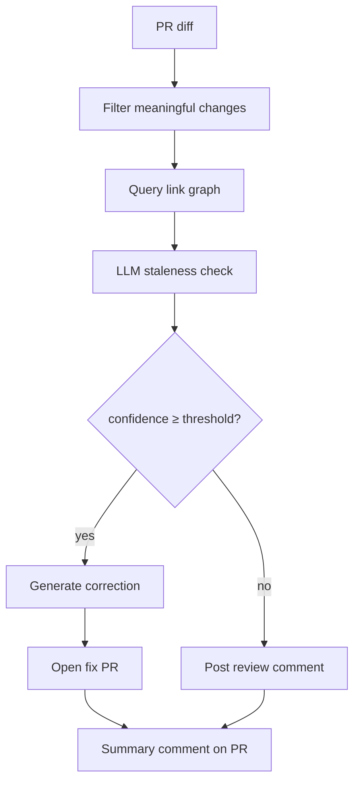

# DocSentinel

DocSentinel runs on pull requests, compares code changes against a pre-built doc-to-code link graph, and flags or auto-corrects documentation that no longer matches the code. High-confidence fixes open a separate PR; lower-confidence hits get a review comment on the triggering PR.

## Quick start

```yaml
- uses: your-org/docsentinel@v0.1.0
  with:
    openai_api_key: ${{ secrets.OPENAI_API_KEY }}
    github_token: ${{ secrets.GITHUB_TOKEN }}
```

## How it works



1. **Diff** — fetch the PR patch; drop tests, whitespace, and comment-only edits.
2. **Link graph** — map changed code chunks to doc sections via ChromaDB cosine similarity.
3. **Staleness check** — LLM verifies each linked section against the actual code change.
4. **Repair** — two-pass LLM generates a correction, then validates it.
5. **Route** — high confidence → auto-fix PR; low confidence → flag for human review.

## Inputs / outputs

| Name | Required | Default | Description |
| --- | --- | --- | --- |
| `openai_api_key` | yes | — | OpenAI API key |
| `github_token` | yes | — | Token with `contents: write` and `pull-requests: write` |
| `base_branch` | no | `main` | Branch fix PRs target |
| `auto_fix_confidence` | no | `0.85` | Minimum confidence for auto-fix |
| `similarity_threshold` | no | `0.75` | Link-graph cosine similarity cutoff |

| Output | Description |
| --- | --- |
| `stale_sections_count` | Total stale sections found |
| `auto_fixed_count` | Sections auto-corrected via PR |
| `flagged_count` | Sections flagged for human review |

## Confidence routing

Each stale section gets a correction with a 0–1 confidence score. The rewriter runs two LLM passes: generate, then validate. Validation failure applies a penalty and forces `human_review` mode.

| Confidence | Action |
| --- | --- |
| ≥ `auto_fix_confidence` (default 0.85) | Open a fix PR with corrected markdown |
| < threshold | Post a table comment on the triggering PR |

Stale docs are expected output — the action exits 0 unless a system error occurs.

## Local development

```bash
python -m venv .venv && source .venv/bin/activate
pip install -r requirements.txt
cp .env.example .env   # fill in keys

# Index once
python src/main.py index --repo-path /path/to/repo

# Full pipeline against a PR
export GITHUB_REPOSITORY=owner/repo
export PR_NUMBER=42
python src/main.py run --repo-path /path/to/repo --base-branch main --pr-number 42

pytest tests/ -v
```

ChromaDB artifacts land in `.docsentinel/` (`chroma/` + `links.json`). Re-index after large doc or code structure changes.

## Architecture decisions

**ChromaDB (PersistentClient)** — file-backed embeddings, no external vector DB. Runs inside a Docker action with zero infrastructure.

**instructor** — structured LLM outputs as Pydantic models with automatic retry on validation failure. No manual JSON parsing.

**Two-pass LLM rewriter** — first pass drafts the fix; second pass checks that accurate content was preserved and no new errors were introduced. Failed validation downgrades to human review.

**Meaningful-change filter** — test files, import-only `__init__.py` edits, whitespace, and docstring-only changes are dropped before any embedding or LLM call.

## Accuracy metrics

Measured on deliberately stale doc fixtures (internal benchmark, v0.1.0):

| Metric | Value |
| --- | --- |
| True positive rate | X% |
| False positive rate | X% |
| Auto-fix acceptance rate | X% |
| Cost per repo scan | X tokens |
